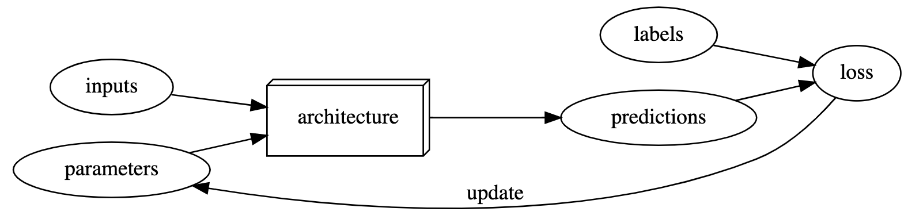

1.  Do you need these for deep learning?

        Lots of math T / <b>F</b>
        Lots of data T / <b>F</b>
        Lots of expensive computers T / <b>F</b>
        A PhD T / <b>F</b>

2.  Name five areas where deep learning is now the best in the world.

    > speach recogniion, computer vision, sales &time series analysis, biology protein analysis, social science etc.

3.  What was the name of the first device that was based on the principle of the artificial neuron?
    > Mark I Perceptron
4.  Based on the book of the same name, what are the requirements for parallel distributed processing (PDP)?
    > A set of processing units  
    > A state of activation  
    > An output function for each unit  
    > A pattern of connectivity among units  
    > A propagation rule for propagating patterns of activities through the network of connectivities  
    > An activation rule for combining the inputs impinging on a unit with the current state of that unit to produce an output for the unit  
    > A learning rule whereby patterns of connectivity are modified by experience  
    > An environment within which the system must operate
5.  What were the two theoretical misunderstandings that held back the field of neural networks?

6.  What is a GPU?
    > Graphic Processing Unit, most of the deep learning libraries are only supported by Nvidia GPU.
7.  Open a notebook and execute a cell containing: 1+1. What happens?
    > "2" will show up.
8.  Follow through each cell of the stripped version of the notebook for this chapter. Before executing each cell, guess what will happen.

9.  Complete the Jupyter Notebook online appendix.

10. Why is it hard to use a traditional computer program to recognize images in a photo?
11. What did Samuel mean by "weight assignment"?
    > finding good weights for the model/architecture. One good way - SGD (sochastic gradient descent)
12. What term do we normally use in deep learning for what Samuel called "weights"?
    > parameters
13. Draw a picture that summarizes Samuel's view of a machine learning model.  
    

14. Why is it hard to understand why a deep learning model makes a particular prediction?
    > because it is only a prediction, not an action. We can interpret it in multiple ways. and the result is intracting with the environment as well.
15. What is the name of the theorem that shows that a neural network can solve any mathematical problem to any level of accuracy?
    > Universal approximation theorem
16. What do you need in order to train a model?
    > data related to the problem
17. How could a feedback loop impact the rollout of a predictive policing model?
    > Positive Feedback Loop: the more the model is used, the more biased the data becomes, making the model even more biased, and so forth (example of ML models assists police arresting suspect, black arrestees rates would keep on increasing)
18. Do we always have to use 224×224-pixel images with the cat recognition model?

19. What is the difference between classification and regression?

    > classfication: predict a class, or category;  
    > regression: predict one or more numeric quantities.

20. What is a validation set? What is a test set? Why do we need them?
    > a validation set is a partition of data that is not included in the training process and is used to calculate the loss (error rate) thus determines how good a model is.  
    > test set is a dataset that we never see during the training process, mostly used in competitions.
21. What will fastai do if you don't provide a validation set?
    > fastai defults valid_pct to 0.2, so even a valid percent is not provided, 20% of the data would be valid set.
