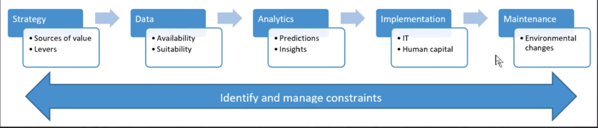

1. Can we always use a random sample for a validation set? Why or why not?
   > not always, expecially for time-series related data. Instead of randomly pooling samples
2. What is overfitting? Provide an example.
   > overfitting can be treated as "cheating" to get good results.
3. What is a metric? How does it differ from "loss"?

   > a metric is a function that measures quality of the model's predictions using the validation set, and will be printed at the end of each epoch. In fastai, error rate is used as the metric. while loss is used in the model to determine how "fit" the model (aka. the performance) is to the data points during training procedule.

4. How can pretrained models help?

   > this is part of the Transfer Learning. Pretrained models can largely increase the accuracy, save time for a new model that is built on top of them.

5. What is the "head" of a model?

6. What kinds of features do the early layers of a CNN find? How about the later layers?

   > layer 1: diagnal lines, gradients, color of green, ...  
   > layer 2: waves, sunset, ...  
   > layer 3: biological structure, text, ...  
   > layer 4: dog faces, animals, ...  
   > layer 5: cars, flower, human faces, ...  
   > ...  
   > That's also the reason whay transfer learning is possible, as elements are identified in the NN layers.

7. Are image models only useful for photos?

   > can also use in sound detection by turning sound into pictures.

8. What is an "architecture"?

   > a model that has data and parameters as input, prediction as output.

9. What is segmentation?

10. What is y_range used for? When do we need it?

11. What are "hyperparameters"?

    > hyperparameters are the parameters for input data set, for example the 224\*224 pixels of a picture.

12. What's the best way to avoid failures when using AI in an organization?

13. What is a p value?

    > starting with null assumption: no relationship at all.  
    >  calculating p value: what is the possibility that we see the relationship at random?  
    >  BUT, YOU SHOULD NOT RELY ON P VALUE!!  
    >  as it doesn't tell you the probability of the exsitance of the relationship.  
    >  See the guidance from American Statistical Associoation
    > https://www.amstat.org/asa/files/pdfs/p-valuestatement.pdf

14. What is a prior?

    > our belief (before the data modeling), which is what we tend to belief based on the previous facts.

15. Provide an example of where the bear classification model might work poorly in production, due to structural or style differences in the training data.

    > healthy skin example, most of the online imgs about healthy skin is a women touching her skin, and that is how your model will take as a concept of healthy skin.

16. Where do text models currently have a major deficiency?

17. What are possible negative societal implications of text generation models?

18. In situations where a model might make mistakes, and those mistakes could be harmful, what is a good alternative to automating a process?

    > manual process, limited scope deployment and gradual expansion.

19. What kind of tabular data is deep learning particularly good at?

    > complex data with hundreds and thousands of parameters, as it has a strong flexibility with the neurons.

20. What's a key downside of directly using a deep learning model for recommendation systems?

21. What are the steps of the Drivetrain Approach?

22. How do the steps of the Drivetrain Approach map to a recommendation system?

23. Create an image recognition model using data you curate, and deploy it on the web.

24. What is DataLoaders?

    > data loader is a class in fastai that determines how data, labels are loaded and transformed.

25. What four things do we need to tell fastai to create DataLoaders?

26. What does the splitter parameter to DataBlock do?

27. How do we ensure a random split always gives the same validation set?

### Extra Notes:

---

- uni-variate model vs. multi-variate model:
  > After adding more variables, the model could be more significant (more confident) as the co-relationship of the variables.  
  > However, we should always look into the "practical importance", which is referred by the slopes.  
  > One way to examine the practical importance would be actually fit the slopes into the data, and see what the effect towards the dependent variable (Y). If the effect/outcome is very sharp, then it is practically significant.

* practical data modeling:

  > 

* dataloader function:
  > bears = DataBlock(  
  >  blocks=(ImageBlock, CategoryBlock),  
  >  get_items=get_image_files,  
  >  splitter=RandomSplitter(valid_pct=0.2, seed=42),  
  >  get_y=parent_label,  
  >  item_tfms=Resize(128))
